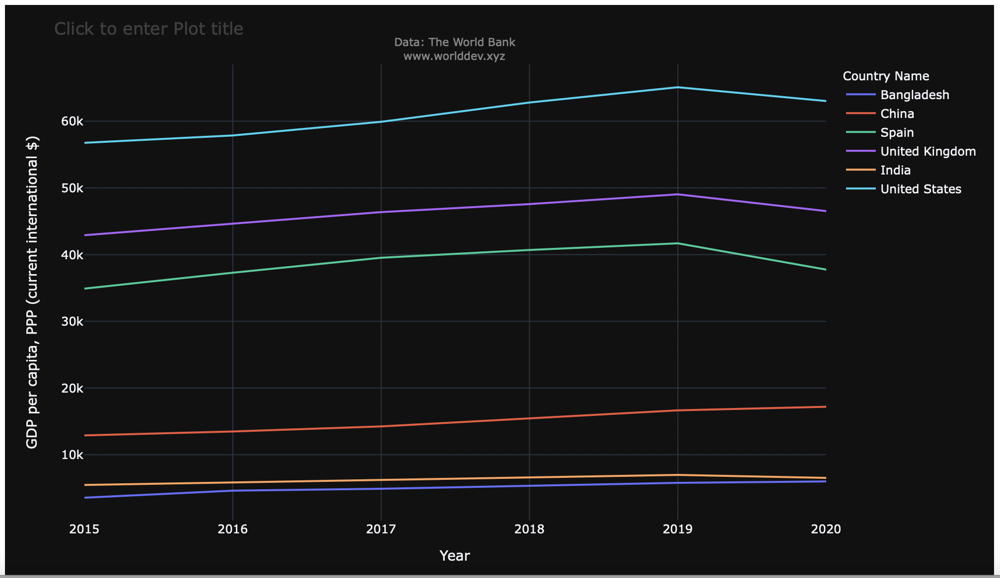
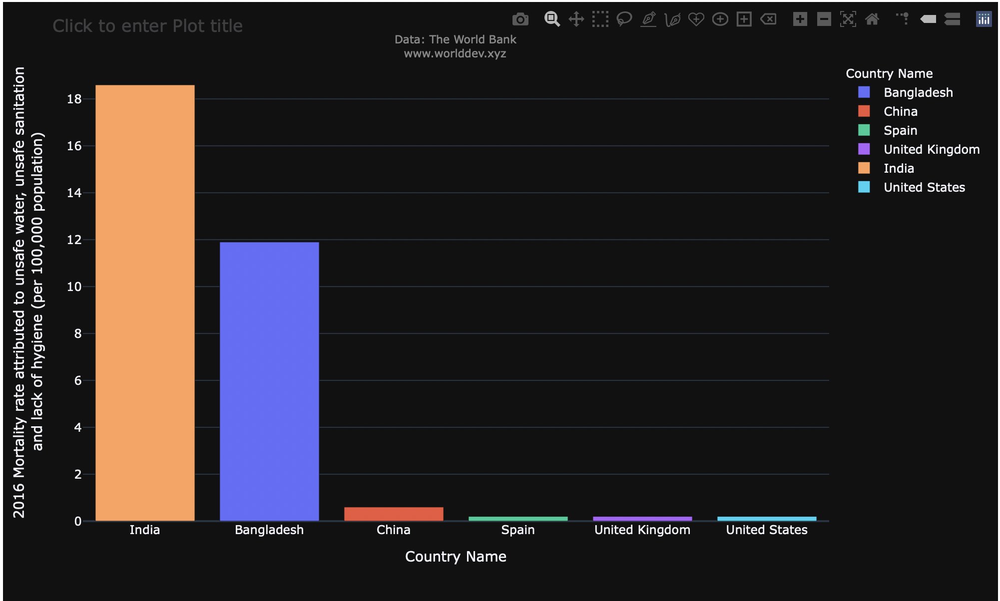
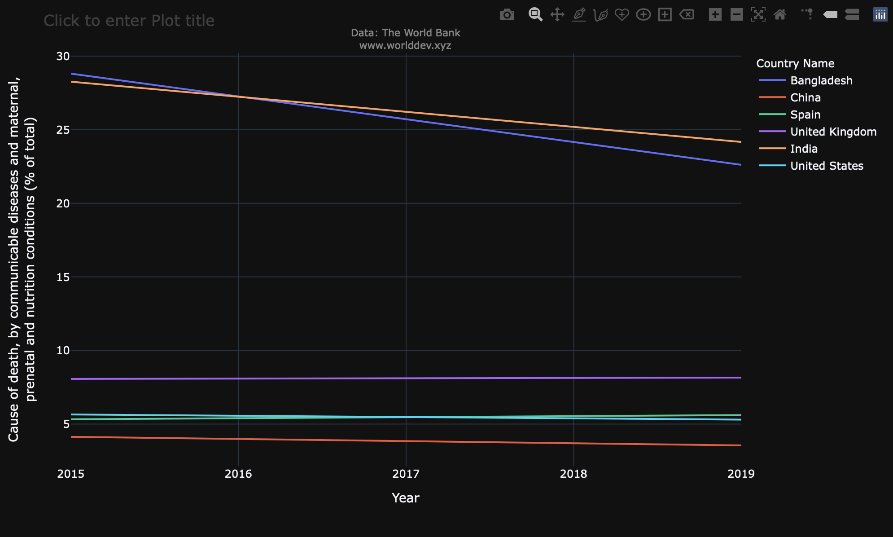
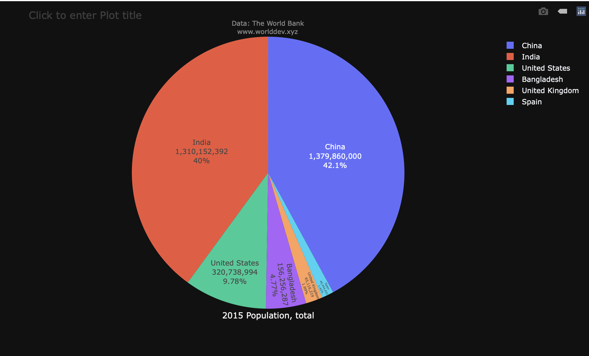
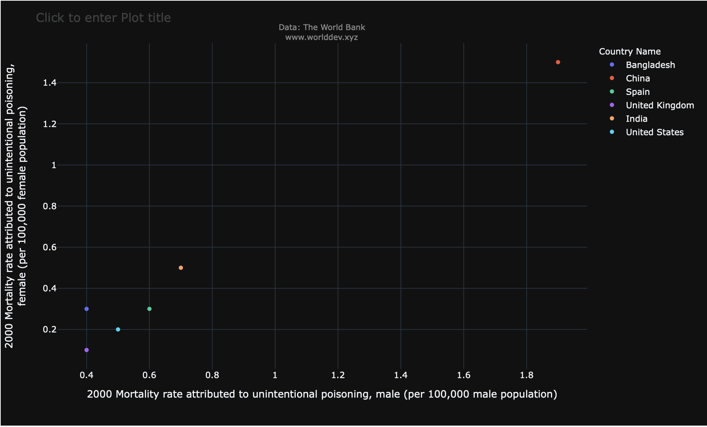
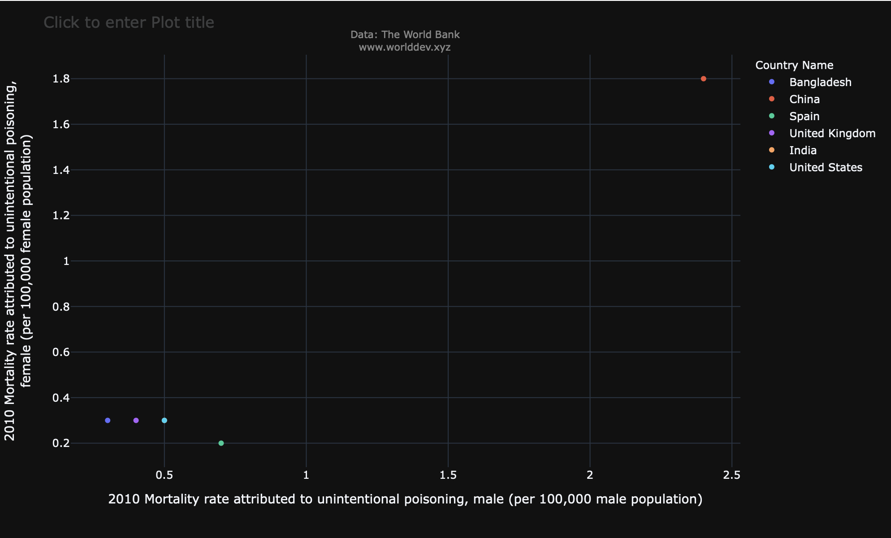

# 690IndividualProject_Part-A
  Name: Ramteja Ponnaagnti
# Topics Included:
- Economy and Growth
- Health
- Environment

# Indicators Included:
- GDP per capita, PPP (current international $): This indicator is part of Economy and Growth topic. GDP stands for Gross Domestic Product which means gross domestic product divided by midyear population. It defines the country’s economic output.
- Population, total: This indicator is part of Health topic which defines the total number of population for each country in respective years.
- Cause of death, by communicable diseases and maternal, prenatal and nutrition conditions (% of total): This indicator is part of Health topic which defines the total number of deaths that has occurred due to malnutrition and other various communicable diseases.
- Mortality rate attributed to unsafe water, unsafe sanitation, and lack of hygiene (per 100,000 population): This indicator is part of Environment topic which defines the illness and death rate of various countries.

# Countries Included:
- India
- United States
- China
- United Kingdom
- Spain
- Bangladesh

# Time Period Included:
By the guidance of Prof. Wang, the period of over 6 years starting from the year 2015 to the ending of the year 2020 has been selected.

# Intoduction:
In present world, we see a rapid growth in the technology. In accordance to that technology we also see drastic changes that are being happen in our environment. These changes may be due to modernization or giving more concern regarding the development rather than concentrating on the environment.

In this document we see detailed explanation regarding how these changes have been affecting the health condition of the people and also the economy conditions.

# How does GDP per capita and Mortality rate due to unsafe conditions relate?
## GDP per capita by year in different countries:

From the above time series graph the observations are as follows:
- GDP per capita of Bangladesh is almost consistent from the year 2015 to 2020 when compared to other countries.
- Almost the same trend has been seen for India and China to. They maintained the same consistency over the period of time.
- But the scenario was different in case of USA, Spain and United Kingdom.
- We see an increment in their GDP during there initial years but over the coming years there respective GDP followed downward trend. This may be due to drastic change in the economy or reducing the sources that can generate the economy.

# Mortality rate due to unsafe water, unsafe sanitation, and lack of hygiene in different countries:
Mortality rate is nothing but the measure of the frequency of occurrence of death in a defined population during a specified interval. It is a mathematical representation which is used to measure the illness or death of the people.

The following information can be depicted from the above time series graph:

- India has the highest mortality rate in the year 2016 when compared to other countries with 18.6.
- China, United States and Spain has less mortality rate with 0.2 These deaths or illness are due to the exploitations that humans are creating in the name of development. For example, if an industry is constructed with in the city, then it affects severely the people living in its surroundings.

Also, the wastage from such organizations should be monitored and that wastage must be diverted to preestablished places rather than diverting them to open water. In the above graph we see few deaths occurred because of unsafe water, this is majorly due to the pollution that the industries create. This is just one example; we see many cases that are happening around us on frequent basis.

# How does mortality rate relate with total population and number of deaths that are caused by the communicable diseases?

The above observations of mortality rate and total population are as follows:

- China has the highest number of population but when we see the deaths that are caused due to communicable diseases and maternal, prenatal and nutrition conditions it has very less numbers. This has proven that though the country has the largest numbers in terms of population, it can still be healthy by following proper nutrition.
- But in case of India, we see quite interesting numbers. India has the second highest population and initially in the year 2015 it even has highest number of deaths. On a good note, these numbers got reduced to an extent by the year and till date from 2015 those numbers are still decreasing.
- It all depends on the country’s GDP because these deaths can be reduced by practicing the nutrition diet. This requires some budget to be allocated and that’s the reason we see a smaller number of communicable deaths in the developed nations and a greater number of cases in less developed nations.
- For example, in this case we see Bangladesh though it has population that other countries we see greater number of deaths and its number for the GDP is almost very less.

In the below 2D scatterplots, we can observe the comparison of the female and male infant death counts starting in 2000 and the overall death counts at the end of the decade. i.e 2010.

Comparison of Female vs Male Death Counts in 2000

Comparison of Female vs Male Death Counts in 2010

# Conclusion:

These observations are made on the data that has been compared among the few countries. GDP acts as the key for the country to decide whether it is developed, under developing or less developed stage. Nations must make efforts to increase their GDP so that they can see progress in every aspect. We can even consider more countries and try to see how this factor called GDP is playing a key role on a larger area.
